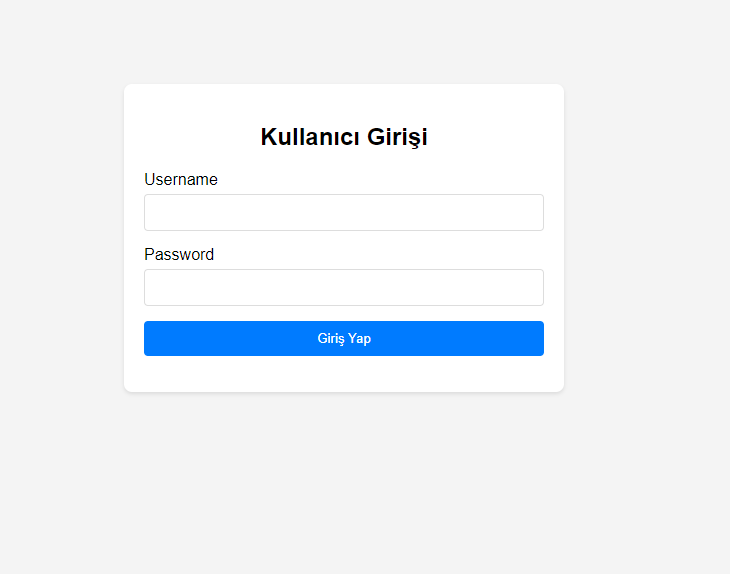

# Kullanıcı Yönetimi 

Bu repo, .NET Core ve ASP.NET Core kullanılarak geliştirilen modern ve güvenli bir kullanıcı yönetimi sistemini içermektedir. Sistem, kullanıcı kaydı, girişi, bilgi güncellemesi ve silme işlemlerini desteklemekte olup, aynı zamanda kullanıcı etkinliklerini loglama ve yönetme özellikleri sunmaktadır. Arayüz tasarımında HTML, CSS ve JavaScript teknolojileri kullanılmış, veritabanı olarak PostgreSQL entegre edilmiştir. Güvenlik, veri doğrulama ve kullanıcı dostu arayüz tasarımı projenin ana odak noktalarıdır.

## İçindekiler

- [Kullanıcı Yönetimi Dokümanı](#kullanıcı-yönetimi-dokümanı)
  - [İçindekiler](#içindekiler)
  - [Kullanıcı Ekleme](#kullanıcı-ekleme)
  - [Kullanıcı Güncelleme](#kullanıcı-güncelleme)
  - [Kullanıcı Silme](#kullanıcı-silme)
  - [Kullanıcı Listeleme](#kullanıcı-listeleme)
  
  
## Login 

Kullanıcı girişi kullanıcı adı ve şifre ile yapılır.

## Kullanıcı Ekleme

Yeni bir kullanıcı eklemek için aşağıdaki adımları izleyin:

1. `Kullanıcılar` sayfasına gidin.
2. `Yeni Kullanıcı Ekle` butonuna tıklayın.
3. Gerekli bilgileri doldurun (Kullanıcı adı, şifre, adı, soyadı).
4. `Kaydet` butonuna basın.

## Kullanıcı Güncelleme

Mevcut bir kullanıcının bilgilerini güncellemek için:

1. Kullanıcı listesinden güncellenecek kullanıcıyı bulun.
2. İlgili kullanıcının yanındaki `Düzenle` butonuna tıklayın.
3. Güncellemek istediğiniz bilgileri değiştirin.
4. `Güncelle` butonuna basın.

## Kullanıcı Silme

Bir kullanıcıyı silmek için:

1. Kullanıcı listesinden silinecek kullanıcıyı bulun.
2. İlgili kullanıcının yanındaki `Sil` butonuna tıklayın.
3. Silme işlemini onaylayın.

## Kullanıcı Listeleme

Sistemde kayıtlı tüm kullanıcıları görmek için:

1. `Kullanıcılar` sayfasına gidin.
2. Kayıtlı tüm kullanıcılar bu sayfada listelenecektir.
